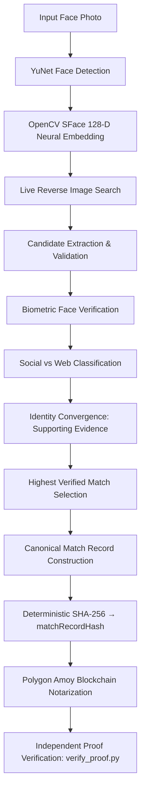
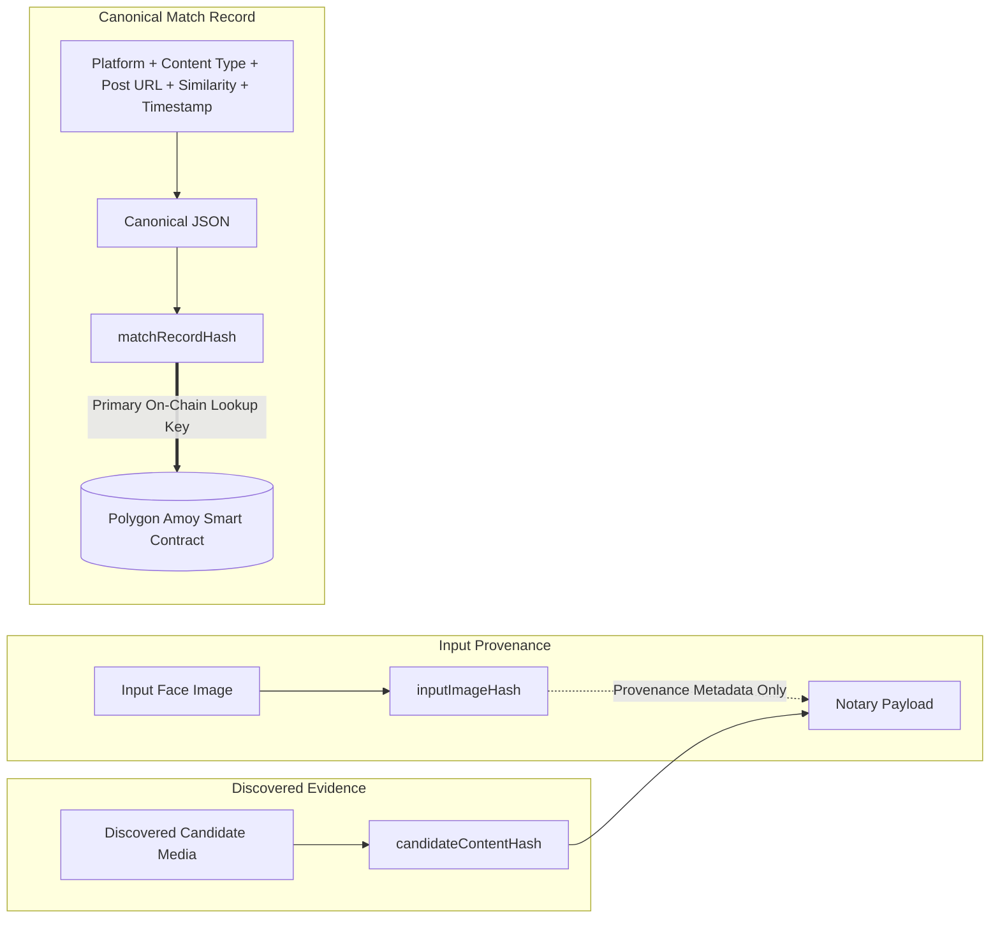
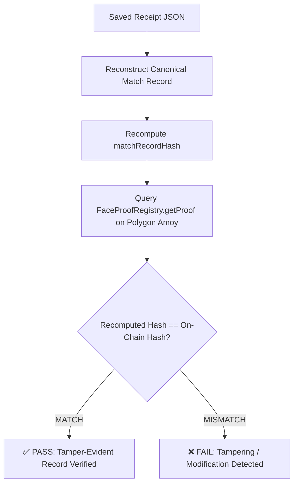

# Facemap: Face ID + Reverse Search + Blockchain Verification Pipeline

[](https://www.python.org/downloads/)
[](https://amoy.polygonscan.com/address/0x1aD68F403Da3B0C800CC7A8666bD107efdd0B331)
[](LICENSE)
[](tests/)

An end-to-end computer vision and blockchain verification pipeline that detects and encodes a face from an input photo, discovers matching web and social-media candidates via live reverse-image search, biometrically cross-verifies candidate faces, deterministically constructs a **canonical match record**, anchors that match proof to the Polygon Amoy blockchain, and independently verifies the integrity of the record against the immutable on-chain state.

---

## ✦ 1. System Architecture & Workflows

### End-to-End Pipeline


> [!IMPORTANT]
> **Candidate Origin & Identity Resolver Policy**: All candidate content evaluated by Facemap originates exclusively from genuine live reverse-image-search results. The Identity Resolver provides supporting contextual evidence (such as subject name attribution and confidence) and does **NOT** perform secondary searches or crawl social media accounts using the resolved person's name.

---

## ✦ 2. Cryptographic Integrity Model (Three-Hash Architecture)

Facemap implements a strict cryptographic separation of concerns to guarantee tamper-evidence while preserving privacy:



### 1. `inputImageHash`
- **SHA-256 fingerprint of the original input image.**
- Establishes the exact cryptographic provenance of the source query photo.

### 2. `candidateContentHash`
- **SHA-256 fingerprint of the discovered candidate media/content artifact.**
- Cryptographically binds the proof to the exact media file discovered online.

### 3. `matchRecordHash`
- **SHA-256 hash of the deterministic canonical verified match record.**
- Represents the primary on-chain lookup key anchored in the smart contract.

> [!NOTE]
> **On-Chain Privacy**: Raw face images and raw 128-D neural embeddings are **never stored on-chain**. The blockchain stores only cryptographic hash digests and necessary verification metadata.

---

## ✦ 3. Match Selection Policy

Facemap evaluates candidates according to a deterministic biometric selection rule:

1. **Origin of Evidence**: All candidates originate from live reverse-image-search results.
2. **Biometric Face Verification**: Each downloaded candidate image is analyzed with YuNet + SFace. Cosine similarity is evaluated against the verification threshold:
   ```text
   Face Similarity ≥ 70.00% → Verified Biometric Match
   Face Similarity < 70.00% → Rejected / Ineligible
   ```
3. **Content Validation**: Generic platform homepages, login walls, or top-level profile shells without direct candidate post media are filtered out.
4. **Primary Social Match Selection**: Among all eligible verified social-media candidates, **the candidate with the highest biometric face similarity is selected as the Primary Social Match**. There is no platform priority (for example, if an X candidate scores 94.34% and an Instagram candidate scores 89.00%, the X candidate is selected solely based on higher biometric similarity).
5. **Related Verified Social Content**: Additional verified social candidates meeting the threshold (≥ 70%) are presented as supporting related verified social content.
6. **Web Discovery Fallback**: If zero verified social-media candidates meet the threshold, the highest-scoring verified non-social web candidate is presented as the **Top Verified Web Discovery**. In this scenario, blockchain notarization is skipped.
7. **No Secondary Social Querying**: Facemap does not trigger a secondary social-media search using the resolved identity name.

---

## ✦ 4. Verified Execution & Verification Certificate

The following record documents an actual live execution performed on the Polygon Amoy blockchain:

### Live Execution Summary
- **Input Image**: [`sample_images/unknown.webp`](sample_images/unknown.webp)
- **Identified Subject**: Tom Holland (99% Identity Convergence Confidence)
- **Primary Social Match**: **X (Twitter)**
- **Discovered Content**: [https://x.com/i/status/2095857089734443264](https://x.com/i/status/2095857089734443264)
- **Biometric Cosine Similarity**: **94.34%** (Decision: `94.34% ≥ 70.00%` → Verified Match)
- **Candidate Content Hash**: `11eebb9783bfe9d39361a22c0a09f2e4fbf2a0c19cf91d52e47428e63501589f`
- **Anchored `matchRecordHash`**: `a0770c599b9475f1681861c3f88a61005e94062f10d967c474820e8437f17392`
- **Blockchain Network**: Polygon Amoy Testnet (Chain ID: `80002`)
- **Block Number**: `46862573`
- **Transaction Hash**: [`0xfcd0ba87e84f6e6bd55b8127a29f4086f29139abe5fd78074c4e631d10f63db2`](https://amoy.polygonscan.com/tx/0xfcd0ba87e84f6e6bd55b8127a29f4086f29139abe5fd78074c4e631d10f63db2)
- **Saved Receipt File**: [`receipts/unknown_receipt.json`](receipts/unknown_receipt.json)

### Actual Verification Certificate
```text
 ╔══════════════════════════════════════════════════╗  
 ║           FACEMAP VERIFICATION CERTIFICATE       ║  
 ╚══════════════════════════════════════════════════╝  
╔══════════════════════════╦══════════════════════════╗
║ Face Match               ║ ✓ VERIFIED               ║
║ Similarity Score         ║ 94.34%                   ║
║ Social Post              ║ ✓ FOUND                  ║
║ Platform                 ║ TWITTER                  ║
║ Content Type             ║ Post                     ║
║ Candidate Content Hash   ║ 11eebb9783bfe9d3...      ║
║ Match Record Hash        ║ a0770c599b9475f1...      ║
║ Blockchain               ║ Polygon Amoy Testnet     ║
║ Transaction              ║ ✓ CONFIRMED              ║
║ On-Chain Verification    ║ ✓ PASSED                 ║
║ Security Guarantee       ║ 🔒 TAMPER-EVIDENT RECORD ║
╚══════════════════════════╩══════════════════════════╝
```

---

## ✦ 5. Threat Model & Anti-Tamper Guarantees

The integrity of every match record is protected by deterministic canonical serialization and SHA-256 cryptographic hashing. Any modification alters the hash digest and is immediately detected:

| Attack Scenario | Modification Tested | Computed Hash vs On-Chain | Detection Status |
|---|---|---|---|
| **Baseline Untampered** | Original authentic receipt | `a0770c599b9475f1...` | ✅ **VERIFIED (Exact Match)** |
| **Tamper Attack 1** | Post URL modified | `7e01ea9c3fbc5ecb...` | ❌ **REJECTED (Hash Mismatch)** |
| **Tamper Attack 2** | Candidate image content substituted | `51cd05e05e229ee7...` | ❌ **REJECTED (Hash Mismatch)** |
| **Tamper Attack 3** | Face similarity inflated (94.34% → 99.99%) | `5d94353748d1c32c...` | ❌ **REJECTED (Hash Mismatch)** |
| **Tamper Attack 4** | Discovery timestamp altered (+24 hours) | `09bf51ebb5773eea...` | ❌ **REJECTED (Hash Mismatch)** |

---

## ✦ 6. Independent Blockchain Verification (`verify_proof.py`)

Any party with a match receipt can independently verify the authenticity and integrity of the proof directly against the blockchain without needing the original input image:



### Verification Command
```bash
python verify_proof.py --receipt receipts/unknown_receipt.json
```

---

## ✦ 7. Hacker House Goa 2026 — Task #3 Compliance

| Requirement | Facemap Implementation |
|---|---|
| **Face detection** | OpenCV YuNet |
| **Face encoding** | OpenCV SFace 128-D Neural Network |
| **Genuine reverse-image search** | Live reverse-image-search pipeline |
| **Social-media matching** | Biometric verification of discovered social content |
| **Blockchain proof** | Polygon Amoy Testnet (`FaceProofRegistry.sol`) |
| **Tamper-evident record** | Deterministic canonical record + SHA-256 hashing |
| **Independent verification** | `verify_proof.py` CLI utility |
| **Tamper testing** | Comprehensive anti-tamper test suite (`test_tamper.py`) |
| **Website required** | No |

---

## ✦ 8. Supported Social Media & Content Platforms

Facemap recognizes eligible social-media and content domains returned by the reverse-search providers and validates their accessibility and post structure before biometric ranking. Supported domains include:
- **Social Networks**: Instagram, X (Twitter), Reddit, Facebook, Threads, Bluesky, Mastodon, TikTok
- **Professional & Media**: LinkedIn, YouTube, GitHub, Medium

---

## ✦ 9. Blockchain Network & Smart Contract

| Parameter | Value |
|---|---|
| **Network** | **Polygon Amoy Testnet** (Chain ID: `80002`) |
| **RPC Endpoint** | `https://polygon-amoy.drpc.org` (with multi-RPC fallback) |
| **Registry Contract** | `0x1aD68F403Da3B0C800CC7A8666bD107efdd0B331` |
| **Contract Explorer** | [amoy.polygonscan.com/address/0x1aD68F403Da3B0C800CC7A8666bD107efdd0B331](https://amoy.polygonscan.com/address/0x1aD68F403Da3B0C800CC7A8666bD107efdd0B331) |

---

## ✦ 10. Project Structure

```text
Facemap/
├── contracts/
│   └── FaceProofRegistry.sol
├── models/
│   ├── face_detection_yunet_2023mar.onnx
│   └── face_recognition_sface_2021dec.onnx
├── src/
│   ├── face_engine/
│   │   └── detector.py
│   ├── search_engine/
│   │   ├── reverse_search.py
│   │   ├── identity_resolver.py
│   │   ├── name_extractor.py
│   │   ├── social_extractor.py
│   │   └── social_validator.py
│   ├── matcher/
│   │   ├── face_matcher.py
│   │   └── match_record.py
│   ├── blockchain/
│   │   ├── contract_abi.py
│   │   ├── notary.py
│   │   └── verifier.py
│   ├── utils/
│   │   ├── crypto_utils.py
│   │   └── ui_display.py
│   └── config.py
├── tests/
├── sample_images/
├── receipts/
├── run_pipeline.py
├── verify_proof.py
├── test_tamper.py
├── demo_run.py
├── requirements.txt
└── README.md
```

---

## ✦ 11. Installation & Usage

### 1. Installation
```bash
git clone https://github.com/theanshukr/Facemap.git
cd Facemap
pip install -r requirements.txt
```

### 2. Configure Environment
Copy `.env.example` to `.env`:
```ini
BLOCKCHAIN_NETWORK=polygon_amoy
POLYGON_AMOY_RPC_URL=https://polygon-amoy.drpc.org
PRIVATE_KEY=your_private_key_here
REGISTRY_CONTRACT_ADDRESS=0x1aD68F403Da3B0C800CC7A8666bD107efdd0B331
SERPAPI_API_KEY=your_serpapi_key_here
SIMILARITY_THRESHOLD=0.70
```

### 3. Run Full End-to-End Pipeline
```bash
python run_pipeline.py --image sample_images/unknown.webp --network polygon_amoy
```

### 4. Run Pipeline Without Blockchain (`--no-blockchain`)
To evaluate the face detection, reverse-search, and biometric matching stages without dispatching an on-chain transaction:
```bash
python run_pipeline.py --image sample_images/unknown.webp --no-blockchain
```

### 5. Run Independent On-Chain Verification
```bash
python verify_proof.py --receipt receipts/unknown_receipt.json
```

### 6. Run Anti-Tamper Demonstration Suite
```bash
python test_tamper.py --receipt receipts/unknown_receipt.json
```

### 7. Run Automated Test Suite (87 Tests)
```bash
python -m pytest -q
```

---

## ✦ 12. Demo

The recorded demonstration showcases the complete 10-step lifecycle:
1. Input face detection (YuNet)
2. SFace 128-D embedding extraction
3. Live reverse-image search discovery
4. Candidate URL & media validation
5. Biometric face verification against candidates
6. Social vs Web classification
7. Primary match selection (highest biometric similarity)
8. Polygon Amoy blockchain notarization
9. Independent on-chain proof verification (`verify_proof.py`)
10. Multi-vector anti-tamper demonstration (`test_tamper.py`)

*(Demo video link placeholder: [Screen Recording Demo Link])*

---

## ✦ 13. Limitations & Semantic Guarantee

1. **Scope of Blockchain Proof**: Blockchain notarization proves the **cryptographic integrity and tamper-evidence of the discovered match record produced by the pipeline**. It does not legally certify individual real-world identity or guarantee that a social-media account is operated by that person.
2. **Biometric Decision vs Immutable Proof**: Biometric verification (cosine similarity ≥ 70%) makes the mathematical match decision, while the blockchain provides decentralized immutability for the resulting proof.
3. **Search Engine Index Latency**: Live visual search relies on search provider indexes; newly created posts or private social profiles may not be indexed.
4. **Facial Occlusions**: Angles beyond 45° yaw or severe occlusions may reduce embedding similarity below the 70% threshold.
