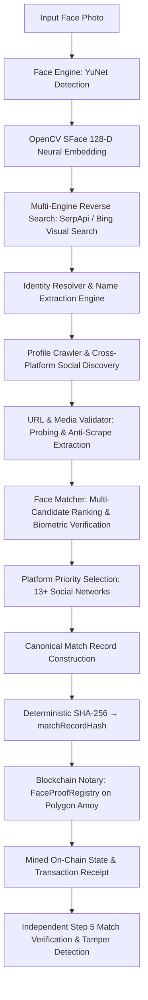
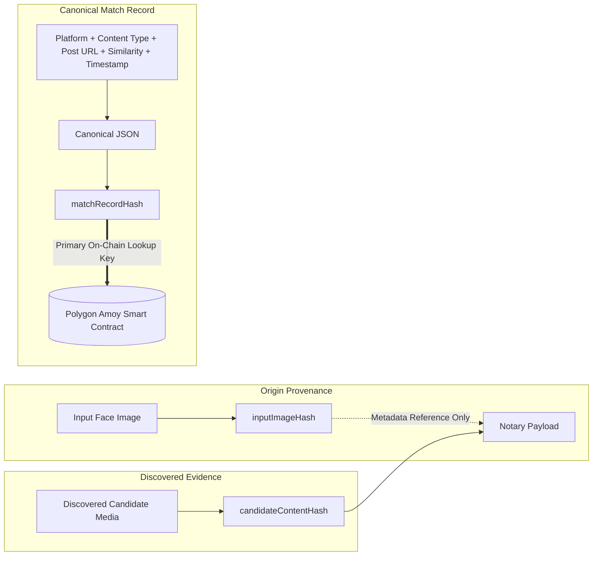
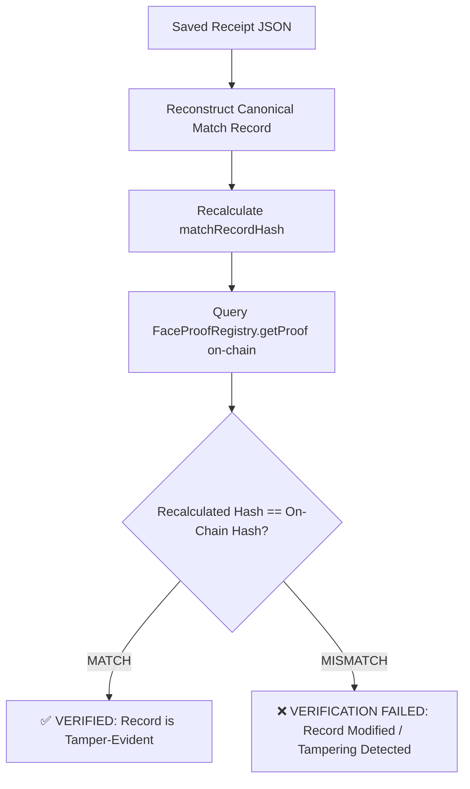

# Face ID + Reverse Search + Blockchain Verification Pipeline

[](https://www.python.org/downloads/)
[](https://amoy.polygonscan.com/)
[](LICENSE)
[](tests/)

An end-to-end computer vision and blockchain pipeline that detects and encodes a face from a photo, finds real matching social-media content via genuine live reverse-image search and identity resolution, biometrically cross-verifies candidate faces, deterministically constructs a **canonical match record**, anchors that match proof to a public blockchain (Polygon Amoy), and independently verifies the integrity of the match record against the on-chain immutable state.

---

## ✦ 1. System Architecture & Workflows

### Diagram 1: End-to-End Pipeline & Identity Discovery


### Diagram 2: Cryptographic Data Integrity & Hash Separation


### Diagram 3: Independent Verification Workflow


---

## ✦ 2. Verification Certificate & Proof Summary

When the pipeline or independent verifier completes Step 5, it renders a cryptographic **Verification Certificate**:

```text
╔══════════════════════════════════════════════════╗
║           FACEMAP VERIFICATION CERTIFICATE       ║
╚══════════════════════════════════════════════════╝
║ Face Match             ✓ VERIFIED                ║
║ Similarity Score       94.27%                    ║
║ Social Post            ✓ FOUND                   ║
║ Platform               INSTAGRAM                 ║
║ Content Type           Post                      ║
║ Candidate Content Hash 8f2a91b4...               ║
║ Match Record Hash      a91c73e0...               ║
║ Blockchain             Polygon Amoy Testnet      ║
║ Transaction            ✓ CONFIRMED               ║
║ On-Chain Verification  ✓ PASSED                  ║
║ Security Guarantee     🔒 TAMPER-EVIDENT RECORD   ║
╚══════════════════════════════════════════════════╝
```

---

## ✦ 3. Threat Model & Anti-Tamper Guarantees

| Modification Attack | Detected? | Cryptographic Mechanism |
|---|---|---|
| **Discovered Post URL Changed** | ✅ **YES** | Breaks canonical JSON serialization; `matchRecordHash` mismatch. |
| **Candidate Image Substituted** | ✅ **YES** | Altered `candidateContentHash` invalidates `matchRecordHash`. |
| **Similarity Score Manipulated** | ✅ **YES** | Altered numeric score alters canonical match fingerprint. |
| **Platform / Content Type Changed** | ✅ **YES** | Altered categorical fields invalidate hash digest. |
| **Discovery Timestamp Altered** | ✅ **YES** | Deterministic timestamp bound in canonical record mismatch. |
| **On-Chain State Modified** | ✅ **YES** | Smart contract data is immutable across EVM blocks. |

> [!IMPORTANT]
> **Semantic Guarantee**: Blockchain anchoring proves the **integrity and tamper-evidence of the discovered match record produced by the pipeline**, not that the social-media account legally belongs to the person or that the platform post is truthful.

---

## ✦ 4. "Why This Match?" Explainability & Search Provenance

The system provides complete algorithmic transparency behind every candidate selection:

```text
SEARCH PROVENANCE & DISCOVERY PIPELINE
• Search Engine:          Live Visual Search (SerpApi / Bing) + Identity Resolver
• Candidates Discovered:  12
• Biometric Candidates:   8
• Social Candidates:      3
• Selected Candidate:     Instagram

MATCH EXPLAINABILITY ANALYSIS
• Face detected:            ✓
• Face embedding generated: ✓ (OpenCV SFace 128-D)
• Reverse-search candidate: ✓ (Live Content Link)
• Candidate face detected:  ✓ (1 face(s) found)

• Face Similarity:          94.27% (Cosine metric)
• Configured Threshold:     70.00% (Default baseline: 40.00%)
• Decision Engine:          94.27% ≥ 70.00% → FACE MATCH VERIFIED
```

### Supported Social Networks & Platforms (13+)
- **Social Media:** Instagram, X (Twitter), Facebook, Reddit, Threads, Bluesky, Mastodon, TikTok
- **Professional & Developer:** LinkedIn, GitHub, Medium, YouTube

---

## ✦ 5. Blockchain Network & Smart Contract

| Parameter | Value |
|---|---|
| **Network** | **Polygon Amoy Testnet** (Chain ID: `80002`) |
| **RPC Endpoint** | `https://polygon-amoy.drpc.org` (with multi-RPC fallback) |
| **Registry Contract** | `0x1aD68F403Da3B0C800CC7A8666bD107efdd0B331` |
| **PolygonScan Explorer** | [amoy.polygonscan.com/address/0x1aD68F403Da3B0C800CC7A8666bD107efdd0B331](https://amoy.polygonscan.com/address/0x1aD68F403Da3B0C800CC7A8666bD107efdd0B331) |

---

## ✦ 6. Installation & How to Run

### Installation
```bash
git clone https://github.com/your-username/facemap.git
cd facemap
pip install -r requirements.txt
```

### Configure Environment
Copy `.env.example` to `.env`:
```ini
BLOCKCHAIN_NETWORK=polygon_amoy
POLYGON_AMOY_RPC_URL=https://polygon-amoy.drpc.org
PRIVATE_KEY=your_private_key_here
REGISTRY_CONTRACT_ADDRESS=0x1aD68F403Da3B0C800CC7A8666bD107efdd0B331
SERPAPI_API_KEY=your_serpapi_key_here
SIMILARITY_THRESHOLD=0.70
```

### Run End-to-End Pipeline
```bash
python run_pipeline.py --image sample_images/mark.jpg --network polygon_amoy --save-receipt my_live_receipt.json
```

### Run Independent On-Chain Verification
```bash
python run_pipeline.py --verify my_live_receipt.json
# or
python verify_proof.py --receipt my_live_receipt.json
```

### Run Anti-Tamper Demonstration Suite
```bash
python test_tamper.py
```

### Run Full Test Suite (87 Tests)
```bash
python -m pytest -q
```

---

## ✦ 7. Known Limitations

1. **Reverse Search Index Latency**: Newly published social posts may take time to appear in search engine visual indices.
2. **Extreme Facial Angles / Occlusions**: Biometric face detection requires primary facial landmarks; angles beyond 45° yaw may produce lower similarity scores.
3. **Probabilistic Biometric Matching**: Cosine similarity is a geometric distance between 128-D neural embeddings and is evaluated against a calibrated threshold rather than serving as absolute legal proof of identity.
4. **Demonstration Network**: Polygon Amoy is an EVM testnet used for demonstration; production deployment would target Ethereum Mainnet or Polygon PoS Mainnet.
